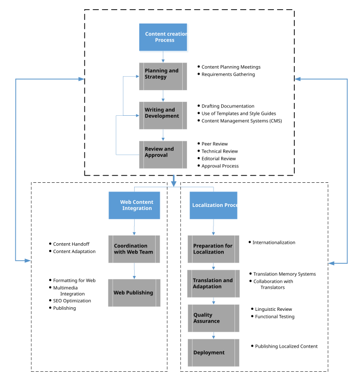

# sudarshan_test
# Day 1: Git Set up

1. Create your **GitHub** account
  Go to [Github](github.com), click Sign up, and follow the prompts (email, username, password, verification). Choose a     professional username — you'll share it often, e.g. as part of a website URL later.
  
2. Install **Git Bash**
  Download Git for Windows from [git-scm.com/downloads](git-scm.com/downloads) and run the installer. Accept the defaults unless you have a reason not to — Git Bash gives you a Linux-style terminal with Git built in.
  
3. Install **Notepad++**
Download from [Notepad++](notepad-plus-plus.org) and install it. You'll use this to open and edit the files inside your cloned repositories.

4. Verify everything works
Open Git Bash and run these two checks. If both return version numbers, you're ready for *Day 2*.

---

- [x] Create your **GitHub** account
- [x] Install **Git Bash**
- [x] Install **Notepad++**
- [x] Verify everything works

```lang ... ```

| Test 1 | Review 1 | Test 2 | Review 2 |
|---|----|---|----|
|Test1|Review is done|Test2|Review is on-going|




